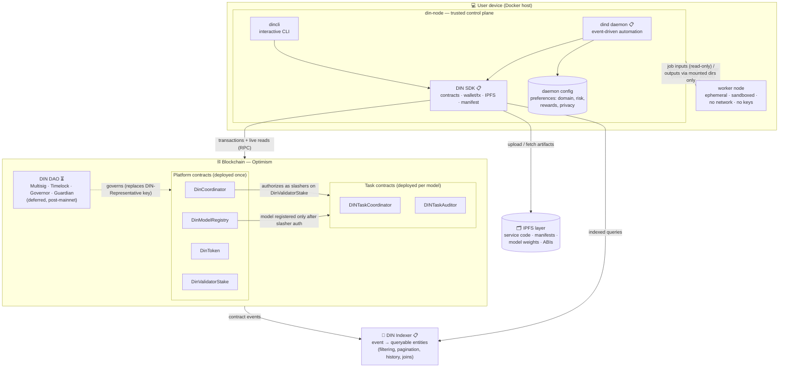

# DIN Protocol — Target System Architecture

**Status:** Working design document — target architecture for the full DIN stack (DevNet → testnet)
**Owner:** Umer
**Scope:** How every DIN component — on-chain contracts, indexer, SDK, CLI, daemon, IPFS layer, and the on-device node/worker pair — fits together; which parts exist today and which are planned.
**Roadmap anchors:** P4 (SDK extraction, `dind` daemon, DIN Indexer); DIN DAO deferred to post-mainnet (2026-08-04 — see [DESIGN_DECISIONS.md DD-3](DESIGN_DECISIONS.md#dd-3--initial-dinmultisig-signer-composition-stage-a)), off-chain governance until then.

> The wiki pages under [DIN Components](https://github.com/InfiniteZeroFoundation/DevNet/wiki) describe each component individually; this document is the one place that shows the whole system and the dependency order between the parts.

---

## 1. The stack at a glance

DIN is organized as six layers. Everything above the chain exists to make participating in on-chain coordination practical: reading state efficiently, submitting transactions safely, moving artifacts through IPFS, and running untrusted model-owner code without exposing keys or data.

| Layer | Components | Status |
|---|---|---|
| Governance | DIN DAO contracts (Multisig, Timelock, Governance staking, Governor, Guardian) | ⏳ Deferred (post-mainnet; off-chain team/forum governance until then) |
| On-chain coordination | Platform contracts: `DinCoordinator`, `DinToken`, `DinValidatorStake`, `DinModelRegistry` | ✅ Deployed (Optimism Sepolia) |
| | Task contracts (per model): `DINTaskCoordinator`, `DINTaskAuditor` | ✅ Deployed per model |
| Read layer | DIN Indexer (subgraph or lighter equivalent) | 📋 Planned (P4) |
| Library | DIN SDK (`dincli/sdk/`): contract interfaces, wallet/tx helpers, IPFS client, manifest loading | 📋 Planned (P4, extracted from `dincli`) |
| Applications | `dincli` (interactive CLI) | ✅ Exists |
| | `dind` daemon (always-on automation + personalized preference config) | 📋 Planned (P4) |
| Storage | IPFS layer (own node / Filebase / custom provider) | ✅ Exists |
| Device runtime | `din-node` (trusted control plane container) + Worker Node (sandboxed job container) | ✅ Exists |

---

## 2. System diagram

> 🔗 **[View as a live, zoomable diagram →](https://mermaidviewer.com/share/LOy1EKd5KZeSQFeycBTyG)** (mermaidviewer.com — same source as below)



📋 = planned component; ⏳ = deferred to post-mainnet; everything else exists on `develop` today.

---

## 3. Layers, top to bottom

### 3.1 DIN DAO contracts (deferred, post-mainnet)

Today the DIN-Representative admin key controls platform parameters (fees, slasher authorization, model registration approval, blacklisting, treasury withdrawal). The original plan was for the DIN DAO to replace that single key with governance contracts — Multisig, Timelock, governance staking (locked non-transferable DIN), Governor, and a Guardian emergency path — rolled out in stages (Multisig shadowing from devnet 2.0, Timelock ownership from devnet 3.0, full Governor voting on testnet).

**As of 2026-08-04, that staged rollout is deferred to post-mainnet.** Abraham's decision (see [DESIGN_DECISIONS.md DD-3](DESIGN_DECISIONS.md#dd-3--initial-dinmultisig-signer-composition-stage-a)): DIN follows Ethereum's off-chain governance model until well past testing — team coordination and public discussion (forums), no `DinMultisig` sitting between the community and protocol upgrades, no immutable signer set locked in before there's real demand or a legitimate selection process. Any near-term multisig is a plain Gnosis Safe scoped to treasury/fund management only, never the protocol-role authority (`PROPOSER_ROLE`/`CANCELLER_ROLE`) this section originally described. On-chain governance gets progressively revisited post-mainnet. Near-term contract work keeps using plain owner-controlled setters, as it already does — there is no Timelock to eventually govern them, so this is no longer a staging step toward one, just how the contracts stay.

### 3.2 Platform contracts (deployed once)

The protocol backbone, deployed once per network by the DIN-Representative:

- **`DinCoordinator`** — ETH↔DIN exchange and the slasher registry (authorizes task contracts to slash on `DinValidatorStake`).
- **`DinToken`** — ERC-20, minted on ETH deposit.
- **`DinValidatorStake`** — validator staking, unbonding, blacklist, slashing entry point.
- **`DinModelRegistry`** — model registration (open-source vs. proprietary fee tiers), manifest update approval.

### 3.3 Task contracts (deployed per model)

Each model owner deploys a **`DINTaskCoordinator`** + **`DINTaskAuditor`** pair that runs that model's Global Iterations: role registration, local model submission, auditor scoring, two-tier aggregation, and slashing of non-participating validators. The pair must be authorized as slashers via `DinCoordinator` *before* the model can be registered in `DinModelRegistry` — this is the trust link between the task layer and the platform layer.

### 3.4 DIN Indexer (planned)

An off-chain read layer (Graph Protocol subgraph or a lighter equivalent) that consumes events from the platform and task contracts and turns them into queryable entities. It exists to kill the current pattern of RPC counter-enumeration loops in the CLI: filtering, sorting, pagination, historical views, and cross-contract joins belong off-chain, keeping the contracts minimal and event-focused. Consumers: the SDK (and through it the CLI), the daemon's event-driven job triggers, and future dashboards. Build order is deliberate — the indexer follows contract-stability milestones so mappings aren't rebuilt against moving targets.

### 3.5 DIN SDK (planned)

The extraction of `dincli`'s reusable core into a library layer (`dincli/sdk/`) any Python program can import: typed contract interfaces (platform + task), wallet/keystore and transaction-building helpers, the IPFS client abstraction, and manifest loading/CID resolution. The SDK is the *only* component that talks to the outside world — chain RPC for transactions and live reads, the indexer for bulk/historical queries, IPFS for artifacts. Everything above it (CLI, daemon, third-party tools) composes these primitives instead of reimplementing them.

### 3.6 Applications: `dincli` and `dind`

- **`dincli`** (exists) — the interactive Typer CLI with one sub-app per role (`model-owner`, `client`, `auditor`, `aggregator`, `dindao`, …). Today it *contains* the functionality the SDK will extract; post-extraction its commands keep working unchanged as thin wrappers.
- **`dind`** (planned) — the always-on daemon that automates participation: it watches on-chain events (via the indexer), decides which jobs to take based on a **personalized local configuration** (preferences on domain, risk tolerance, expected rewards, privacy constraints), orchestrates sandboxed Worker Node jobs with resource awareness and failure recovery, and persists execution state across restarts. Ships with `start/stop/status`, health endpoints, and structured logging. CLI and daemon coexist and share preferences/state through the SDK layer.

### 3.7 IPFS layer

All CID-addressed artifacts — model-owner service code (`model.py`, `client.py`, `auditor.py`, `aggregator.py`, `modelowner.py`), manifests, model weights, ABIs — flow through one abstraction (`dincli/services/ipfs.py`, future `sdk`) with three interchangeable backends: an env-configured IPFS node, Filebase, or a fully custom Python provider. Only CIDs go on-chain; content lives here. Per-directory CID caches ensure artifacts are re-fetched only when their CID changes.

### 3.8 Device runtime: `din-node` and Worker Node

The on-device split enforces the protocol's core security boundary:

- **`din-node`** (trusted control plane) — the containerized run path for validators. It holds the wallet, config, and state (single `DIN_STATE_DIR`, bind-mounted at the same absolute path inside and outside the container), talks to chain and IPFS, and decides what to submit. Today its main process is idle and operators drive it via `docker compose exec dincli …`; with P4, `dind` becomes the main process.
- **Worker Node** (untrusted execution) — an ephemeral `docker run --rm` container that executes model-owner code (training, scoring, aggregation) treated as hostile: `--network none`, no wallet/config/Docker-socket access, CPU/memory caps, read-only job inputs, outputs written to designated directories only. Workers are spawned as *siblings* on the host Docker daemon (din-node mounts the host Docker socket), which is why the shared state path must match on both sides.

```
┌──────────────────────────── User device (Docker host) ────────────────────────────┐
│                                                                                   │
│  ┌───────────── din-node (trusted) ─────────────┐   ┌── worker node (untrusted) ─┐│
│  │  dind 📋 ──► DIN SDK 📋 ◄── dincli           │   │  model-owner code:         ││
│  │    │            │                            │   │  train / score / aggregate ││
│  │  prefs &     wallet · tx · IPFS · manifest   │   │                            ││
│  │  daemon      ────────────────────────────    │   │  --network none            ││
│  │  config      state in DIN_STATE_DIR          │   │  no keys · no socket       ││
│  └──────┬──────────────┬────────────────────────┘   │  cpu/mem caps · --rm       ││
│         │              │                            └──────────▲─────────────────┘│
│         │              │ host Docker socket                    │ sibling spawn    │
│         │              └───────────────────────────────────────┘                  │
│         │  job dirs: inputs read-only ──► worker ──► outputs to designated dirs   │
└─────────┼─────────────────────────────────────────────────────────────────────────┘
          │
          ▼ (only din-node talks to the outside)
   chain RPC · DIN Indexer 📋 · IPFS
```

---

## 4. Key flows

**Write path (transactions).** CLI command or daemon decision → SDK builds and signs the tx (keystore in `DIN_STATE_DIR`) → chain RPC → platform or task contract. Workers never sign or submit anything.

**Read path.** Live, single-item state (current GI phase, a specific stake) → direct RPC. Bulk, filtered, or historical queries (all models in a domain, a validator's slash history) → indexer. Until the indexer exists, everything goes over RPC — that inefficiency is the indexer's motivation, not a design choice.

**Artifact path.** Model owner uploads service files + manifest → IPFS → CIDs referenced on-chain/in-manifest → SDK on a participant device fetches by CID (cache-checked) → daemon mounts them read-only into a worker → worker writes results → SDK uploads outputs to IPFS → CID submitted on-chain.

**Automation path (target state).** Contract event (phase opened, batch assigned) → indexer → `dind` matches it against the operator's preference config → spawns a worker for the job → collects the output → submits via SDK → records state for crash recovery.

---

## 5. Dependency order

The build sequence follows the arrows in the diagram, bottom-up on the off-chain side:

1. **Contracts stabilize first** — indexer mappings and SDK contract interfaces are built against stable events/ABIs, not moving targets.
2. **SDK before daemon** — `dind` imports the SDK; extracting the SDK while the CLI keeps working is the low-risk first step of P4.
3. **Indexer before event-driven automation** — `dind` can launch in a degraded RPC-polling mode, but its preference-driven job selection assumes indexer queries.
4. **DAO deferred, not sequenced into P4 at all** — governance would wrap the platform contracts' existing owner surface (changing *who* calls the setters, not the setters themselves), but per §3.1 it's now post-mainnet work, not a P4 build step.

---

## Further reading

- Wiki: [Platform Contracts](https://github.com/InfiniteZeroFoundation/DevNet/wiki/Platform-Contracts) · [Task Contracts](https://github.com/InfiniteZeroFoundation/DevNet/wiki/Task-Contracts) · [DIN Indexer](https://github.com/InfiniteZeroFoundation/DevNet/wiki/DIN-Indexer) · [DIN SDK](https://github.com/InfiniteZeroFoundation/DevNet/wiki/DIN-SDK) · [DIN Daemon](https://github.com/InfiniteZeroFoundation/DevNet/wiki/DIN-Daemon) · [DIN DAO](https://github.com/InfiniteZeroFoundation/DevNet/wiki/DIN-DAO) · [DIN Node](https://github.com/InfiniteZeroFoundation/DevNet/wiki/DIN-Node) · [Worker Node](https://github.com/InfiniteZeroFoundation/DevNet/wiki/Worker-Node) · [IPFS Layer](https://github.com/InfiniteZeroFoundation/DevNet/wiki/IPFS-Layer)
- Current-state docs: [`Documentation/public/workflows/din-workflow.md`](../../Documentation/public/workflows/din-workflow.md), [`Documentation/public/workflows/model-workflow.md`](../../Documentation/public/workflows/model-workflow.md), [`Documentation/public/guides/ipfs.md`](../../Documentation/public/guides/ipfs.md)
- Related design: [`MECHANISM_DESIGN.md`](MECHANISM_DESIGN.md) (staking/slashing/rewards/fees for DevNet 2.0)
