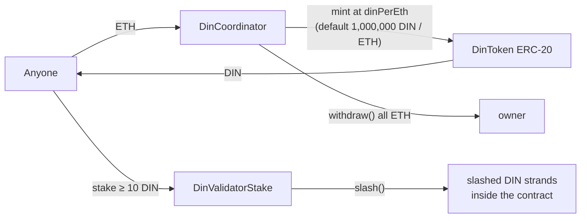
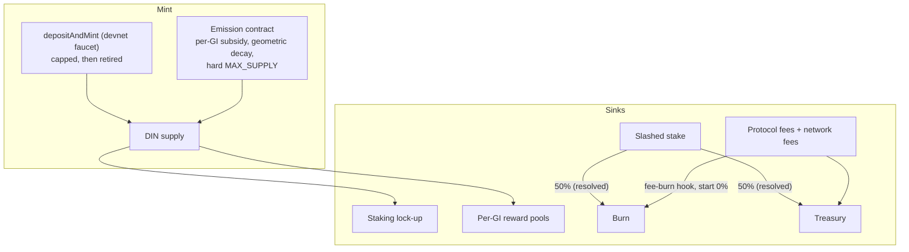

# DIN Tokenomics — Design (easy-to-follow)

**Status:** Working design — the readable entry point for DIN token economics
**Owner:** Umer
**Tracking:** [GitHub issue #42](https://github.com/InfiniteZeroFoundation/DevNet/issues/42) · open decisions in [discussion #45](https://github.com/InfiniteZeroFoundation/DevNet/discussions/45)
**Deep-dive companions:** [MECHANISM_DESIGN §7–§8](MECHANISM_DESIGN.md) (consolidated design), [issues/tokenomics.md](../issues/tokenomics.md) (full problem statement and asset-model options)

---

## 1. DIN today, in one minute

Verified against `foundry/src/` on `develop` (July 19, 2026). Full current-state contract references: [`DinToken.md`](../../Documentation/technical/contracts/DinToken.md), [`DinCoordinator.md`](../../Documentation/technical/contracts/DinCoordinator.md), [`DinValidatorStake.md`](../../Documentation/technical/contracts/DinValidatorStake.md).

- **`DinToken`** is a plain upgradeable ERC-20. The only minter is `DinCoordinator` (wired once via `setCoordinator`). **No supply cap, no burn function, no emission schedule.**
- **`DinCoordinator.depositAndMint()`** mints DIN to anyone who deposits ETH, at an owner-settable rate (`dinPerEth`, default 1M DIN/ETH). This is an **unlimited mint at an admin-set price**. The deposited ETH is withdrawable by `owner()` — there is no reserve policy and no treasury.
- **Utility today:** validator staking in `DinValidatorStake` (min 10 DIN) — that's it. Model-registry fees are paid in **ETH**, rewards are **not implemented**, slashed DIN just sits in the stake contract (an *accidental* burn).

That is fine for a devnet faucet economy. It is not a token-economic system: protocol usage creates no DIN demand, issuance is administrative, and slashing has no defined economic destination.

## 2. The one decision everything else hangs on

**What *is* DIN?** ([issues/tokenomics.md](../issues/tokenomics.md) lays out three options.)

| Option | DIN is… | Consequence |
|---|---|---|
| **A. Utility + staking token** ✅ recommended | An emission-governed work/security token | `depositAndMint` becomes a devnet-only faucet; real issuance is a capped emission schedule; fees/rewards denominated in DIN |
| B. ETH-backed asset | A quasi-redeemable claim on reserves | Requires reserve custody, collateral ratios, redemption rules — heavy machinery DIN doesn't need |
| C. Market-acquired asset | Externally traded collateral | Removes the on-ramp entirely; premature before there is a market |

**Recommendation: Option A.** It matches the white paper (§8: PoS staking token, inflation-funded rewards with decreasing rate, fee burn) and requires the least new machinery. The mixed signals in today's code (ETH backing that the owner can withdraw) go away by *explicitly declaring* DIN unbacked-utility and routing deposit ETH to the treasury.

## 3. Target design

### 3.1 Demand: why anyone holds DIN

1. **Staking** (primary sink) — validators lock DIN to work; per-model stake requirements scale demand with network value ([staking-design.md](staking-design.md)).
2. **Fees** — all protocol fees converge on DIN (registration, manifest updates, per-GI service fee). Today they're ETH; migration below.
3. **Reward-pool deposits** — model owners pre-fund each GI's reward pool in DIN.
4. **Governance weight** — P5+ design hook only, not a 2.0 mechanism.

### 3.2 Supply: where DIN comes from and where it goes

| Flow | Today | Target (DevNet 2.0) |
|---|---|---|
| **Mint — deposit** | Unlimited, admin-priced | ✅ Resolved: keep as devnet on-ramp (faucet mode); route ETH to treasury (not `owner()`); **cap on testnet; retire on mainnet**, replaced by an on-ramp/ICO or validator-airdrop program — both kept open (§9 decision 8) |
| **Mint — emission** | None | New emission contract: mints the per-GI reward subsidy only on GI lifecycle events. ✅ Geometric decay per epoch confirmed. `MAX_SUPPLY`: ✅ resolved as deliberately **open/dynamic for now** (no hard cap at freeze; possible later via governance), not a hard cap set today; per-GI mint ceiling (inflation guard) unchanged |
| **Burn — slashing** | Accidental (stranded) | ✅ Resolved: explicit 50% burn share of slashed stake ([discussion #44](https://github.com/InfiniteZeroFoundation/DevNet/discussions/44)) |
| **Burn — fees** | None | ✅ Resolved: parameterized burn fraction from *both* protocol fees and validator network fees (dual sources), **start at 0%**, hook kept; public-goods routing slot reserved alongside |
| **Treasury** | None | Dedicated treasury contract receiving: network fee split, slashed-stake share, deposit ETH backing. DAO-controlled spend |

### 3.3 How emission works (worked example — illustrative numbers only)

Emission exists to bootstrap: early on there are few paying model owners, so the protocol tops up reward pools; as fees grow, emission decays to zero and **fees fund everything at steady state**.

Illustrative shape (all numbers to be set by the P3-5.2 simulation, **not** commitments). Note: `MAX_SUPPLY` itself is resolved as **open/dynamic for 2.0** (§6, §9-5) — no hard cap enforced at freeze time; the figure below is a future/optional reference point only, for if/when a hard cap is added later via governance:

- `MAX_SUPPLY` = 1,000,000,000 DIN (illustrative future hard cap — not adopted for 2.0)
- Epoch = 30 days; per-GI subsidy in epoch *n* = `S₀ × d ⁿ` with decay `d` = 0.95
- Per-GI inflation guard: emission per GI ≤ `maxMintPerGI` regardless of formula
- Mint trigger: only callable from the GI lifecycle (`endGI` settlement), never ad-hoc

So if `S₀` = 1,000 DIN/GI: epoch 1 → 1,000, epoch 12 → ~570, epoch 24 → ~310, → 0 over ~5 years. The simulation must answer: does pool + emission give stable validator income at target, 10×, and 0.1× participation? (Wrong answers are expensive post-audit — design time is scheduled before contract code.)

### 3.4 Fee denomination

✅ **Resolved (Abraham, via Slack, 2026-07-21) — a split, not DIN for everything.** On-chain protocol fees (registration, manifest updates, staking, rewards) converge on **DIN** (single-asset accounting; reinforces demand; `depositAndMint` makes acquisition trivial on devnet). The per-GI validator network fee (model owner → validator) **stays in ETH** — model owners already pay gas in ETH, and requiring DIN just to pay validators adds friction the on-ramp doesn't fully remove. Migration: add DIN-denominated fee parameters for the protocol-fee lines only, deprecate their ETH variants after one release; the network fee has no ETH-to-DIN migration. Detailed fee lines and the router live in [MECHANISM_DESIGN §8](MECHANISM_DESIGN.md) and issue [#43](https://github.com/InfiniteZeroFoundation/DevNet/issues/43).

## 4. What changes on-chain (contract delta)

| Contract | Change |
|---|---|
| `DinToken` | Add burn capability (burn-from-slash and fee-burn paths); optionally `ERC20Votes` hook later (P5+) |
| `DinCoordinator` | Route deposit ETH → treasury; add minted-total cap; keep `dinPerEth` as devnet faucet parameter with a documented retirement path |
| **New:** `DinEmission` | Per-GI subsidy minting, decay schedule, `MAX_SUPPLY`, inflation guard; only mint path besides the faucet |
| **New:** `DinTreasury` | Receives fee splits, slashed-stake share, deposit backing; DAO/multisig-controlled spend |
| `DinValidatorStake` | Send slashed stake to its declared destinations (burn/treasury) instead of stranding it |
| `DINModelRegistry` | DIN-denominated fee params; fees → treasury instead of `withdrawFees(owner)` |

All new contracts follow the PR #13 conventions (Transparent Proxy, `_disableInitializers()`, `__gap`).

## 5. Parameters (DAO-settable via P3-5.1 governance hooks)

`MAX_SUPPLY` (constant, not settable) · `emissionS0`, `emissionDecay`, `epochLength`, `maxMintPerGI` · `feeBurnFraction` (start 0) · `slashBurnFraction` (proposed 50%) · `dinPerEth` + faucet cap (devnet only) · treasury spend authority.

## 6. Open decisions

| # | Decision | Status | Where |
|---|---|---|---|
| §9-5 | Emission shape + `MAX_SUPPLY` number | ✅ Partially resolved: geometric decay + GI-lifecycle inflation guard confirmed; `MAX_SUPPLY` left open/dynamic for now, hard cap possible later | [Discussion #45](https://github.com/InfiniteZeroFoundation/DevNet/discussions/45), grounded by P3-5.2 simulation |
| §9-4 | Fee denomination DIN-only vs dual-asset | ✅ Resolved: **split** — protocol fees DIN, validator network fees ETH (not DIN-only as previously recommended) | [Discussion #45](https://github.com/InfiniteZeroFoundation/DevNet/discussions/45) |
| §9-8 | `depositAndMint` cap/retirement plan | ✅ Resolved: active on DevNet, capped on testnet, retired on mainnet (ICO or validator-airdrop, both kept open) | [Discussion #45](https://github.com/InfiniteZeroFoundation/DevNet/discussions/45) |
| §9-1 | Slashed-stake destination split | ✅ Resolved: 50/50 burn/treasury | [Discussion #44](https://github.com/InfiniteZeroFoundation/DevNet/discussions/44) |
| §9-3 | Reward split percentages | Still open | Internal, P3-5.2 simulation |
| — | Public-goods funding slot in the fee router (white paper §8 quadratic funding) | ✅ Resolved: reserve the routing slot now, fund later | [Discussion #45](https://github.com/InfiniteZeroFoundation/DevNet/discussions/45), point 4 |

All resolved rows above: Abraham (CEO, white-paper author), via Slack, 2026-07-21 — pending the GitHub discussion threads themselves being updated (see [`p3-design-plan.md`](p3-design-plan.md)).

## 7. Sequencing

1. **Decide the asset model** (Option A) and the §6 decisions — discussions #44/#45.
2. **Simulate** (P3-5.2): emission + pool stability at target/10×/0.1× participation; pick `MAX_SUPPLY`, `S₀`, `d`.
3. **Freeze this spec** — record outcomes here and in [MECHANISM_DESIGN §7](MECHANISM_DESIGN.md).
4. **Contracts** (P3-5.1/5.2 implementation): `DinEmission`, `DinTreasury`, token burn, coordinator rerouting.
5. **Fees follow** ([#43](https://github.com/InfiniteZeroFoundation/DevNet/issues/43), P3-5.3): router + DIN denomination migration.

**Exit criteria** (from [issues/tokenomics.md](../issues/tokenomics.md)): written asset model · bounded/governable issuance · slash settlement complete · rewards implemented · fee routing defined · stake floor economically grounded · governance over treasury/policy · simulations for dilution, Sybil cost, validator profitability, slash scenarios.
