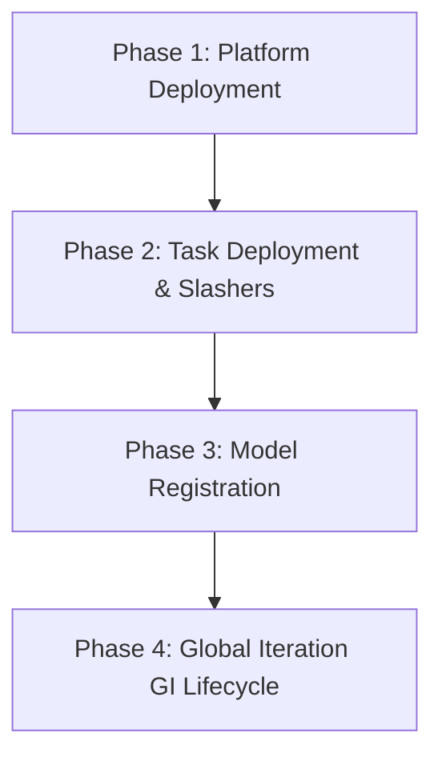

# dincli Integration Test Guide

This guide explains how to run the `tests/dincli/` integration test harness
against a local chain, and documents the architecture of the harness itself.

The chain backend and platform deploy script are chosen by
`PLATFORM_DEPLOY_TOOLCHAIN` (`tests/dincli/constants.py`): **`foundry`
(default)** runs Anvil (`foundry/anvil.sh`) and `foundry/script/DeployPlatform.s.sol`;
`hardhat` runs a Hardhat node and `hardhat/scripts/deploy-platform.ts`. Both use
chain ID 1337 on `http://127.0.0.1:8545`.

> [!WARNING]
> `foundry/anvil.sh` starts Anvil with `--code-size-limit 4294967295`, so the local chain accepts contracts above the 24,576-byte EIP-170 limit. A green local run therefore does not show that a contract can be deployed to a real chain. CI enforces the limit instead, with `.github/scripts/contract_size_gate.py` (issue #201).

---

## Quick start

The conftest manages contract compilation and local chain/IPFS startup.
Install the Python dependencies and chain/IPFS toolchains first. The existing
manual path also requires a repo-root `.env` and a packaged
`dincli/config/accounts.json` containing the public development accounts.
Docker must be running before Phase 4 client training begins.

```bash
# 1. Ensure Docker daemon is running
sudo systemctl start docker   # or Docker Desktop

# 2. Run the full harness (fail-fast, recommended)
cd /path/to/devnet
source ~/my_venvs/pyDIN/bin/activate
pytest tests/dincli/ -v -x -m integration --tb=short 2>&1 | tee ~/tempdir/dincli/results/last_run.txt

# one test 
python -m pytest tests/dincli/test_01_platform.py \
  -v -x -m integration --tb=short -k test_dump_abi_token
```

That's it. The conftest will:
- Compile contracts: `npx hardhat compile` always (the task-contract deploy and
  `dump-abi` tests still use Hardhat artifacts), plus `forge build` for the
  default `foundry` toolchain
- Kill any existing chain node and start a fresh one (clean EVM state): Anvil
  for `foundry`, a Hardhat node for `hardhat`
- Start the IPFS daemon if it is not already running
- Restore `dincli/config/din_info.json` to its committed state after the run

---

## Test architecture (`conftest.py`)

The test suite is structured around a centralized session-scoped `conftest.py`
that isolates dependencies and coordinates services.

### CI smoke groundwork

The first CI preparation change adds opt-in `DIN_TEST_ISOLATED=1` service
ownership and corrects demo bootstrap to use `connect-demo-wallet`. It does
not yet add a Docker runner, a smoke workflow job, or complete seven-contract
deployment assertions. The Python CI job still selects `not integration`.
Full lifecycle wallet switches and later phases are not verified by this change.

In a disposable checkout/environment, isolated mode requires absolute
`DIN_TEST_TMPDIR` and `DIN_TEST_RESULTS_DIR` paths. Scratch must not already
exist; results must be outside scratch. The harness refuses checkout dotenv
files, uses a local-only subprocess environment, creates a fresh offline Kubo
repository, and rejects occupied ports without terminating their processes.
Only newly started process groups are stopped, including when setup fails
before fixture yield. Startup logs remain in the external results directory.
Both compiler paths remain enabled at this foundation stage; the Foundry-only
selection will accompany the later smoke runner.

Isolated bootstrap validates and reuses accounts 0/1 in the checkout's public
`dincli/config/accounts.json`, preserving the file. If absent, it generates
those accounts from the public Anvil mnemonic and removes only that generated
file on teardown. Invalid accounts or symlinks fail setup. `connect-demo-wallet` reads
this file; setting `ETH_PRIVATE_KEY_N` alone does not supply demo accounts.
Existing manual runs must provide their own public account file with enough
entries for the chosen phases. Real-wallet commands deliberately reject demo
wallets and must not be substituted during bootstrap.

The focused tests below exercise startup failures, process ownership,
interruption, account setup and retained evidence without launching Anvil or
IPFS, compiling contracts or contacting a chain:

```bash
python -m pytest tests/test_integration_demo.py \
  tests/test_integration_services.py tests/test_integration_harness.py -q
```

Isolated mode is a harness setting, not a container or a guarantee that an
arbitrary checkout is disposable. Use it only inside an environment you own
for testing. The forthcoming Docker runner will establish that boundary and
provide the shared GitHub/local reproduction command.

### Managed services (`managed_services` fixture)

Before any test runs, the fixture does the following:
1. **Solidity compilation** — runs `npx hardhat compile` in `hardhat/` (the
   task-contract deploys and `dump-abi` tests use Hardhat artifacts), and
   `forge build` in `foundry/` when the toolchain is `foundry` (the platform is
   deployed from `foundry/out/` via `DeployPlatform.s.sol`).
2. **Fresh chain node** — kills any running node and launches a clean one on
   port `8545`: `foundry/anvil.sh` (70 accounts, chain ID 1337) for `foundry`,
   or `npx hardhat node` for `hardhat`.
3. **IPFS daemon** — checks if the IPFS API (`http://127.0.0.1:5001`) is
   running, starting it (`ipfs daemon`) if not. If it was already running
   externally, it is left running at teardown.
4. **Docker daemon** *(pre-requisite, not managed)* — must already be running
   on the host to execute containerized client training, evaluation, and
   aggregation in Phase 4.

### Fixture ordering and `autouse`

Only two fixtures in the conftest are `autouse=True`: `managed_services` and
`bootstrap`. `autouse` means pytest applies the fixture to every test
automatically, without any test naming it in its signature; combined with
`scope="session"` it runs exactly once before the first test, and its teardown
(the code after `yield`) runs once after the last test. Everything else
(`din_tmp`, `din_env`, `workdir`, `din_info_backup`, `state`, `run`) is a plain
session fixture that only runs because something requests it.

`din_tmp` runs first, but not on its own — it is *not* autouse. It executes
first because `managed_services` declares it as a parameter: when pytest sets
up `managed_services`, it resolves the dependency and instantiates `din_tmp`
before running the fixture body. Declaring `din_tmp` as an argument serves two
purposes:

1. **The value is needed** — `managed_services` writes its compile/node/IPFS
   logs to `din_tmp / "results"`.
2. **Ordering is guaranteed** — the temp dir is created and `config/`/`cache/`
   are wiped *before* any service writes logs into `results/`.

The full session setup chain, in execution order:

```
din_tmp                    (create/wipe temp dirs)
  └─ managed_services      (autouse: compile, fresh Hardhat node, IPFS)
bootstrap                  (autouse) depends on:
  ├─ managed_services      (already up)
  ├─ din_info_backup       (snapshot din_info.json for restore at teardown)
  └─ run ─ din_env, workdir
     then: configure-demo + configure-network --network local
```

By the time the first test executes, services are running and the CLI is
configured for the local network.

### Config and state isolation

The conftest redirects `XDG_CONFIG_HOME` and `XDG_CACHE_HOME` to
`~/tempdir/dincli/`, so it never touches `~/.config/dincli` or
`~/.cache/dincli`. Your real wallet and network config are untouched.
`config/` and `cache/` are wiped at the start of each session; `results/`
accumulates across runs.

If a run is interrupted (e.g. Ctrl-C) before session teardown restores
`din_info.json`:

```bash
git checkout dincli/config/din_info.json
```

### Python environments

Two Python environments are used. The conftest's `run()` helper switches
between them automatically per command — no manual activation needed:

| Environment | Path | Used for |
|-------------|------|----------|
| `pyDIN` | `~/my_venvs/pyDIN/bin/python` | All CLI commands except those requiring torch/numpy |
| `torchenv` | `~/my_venvs/torchenv/bin/python` | Genesis model creation, client training, auditor evaluation, aggregation, MNIST distribution |

`TORCHENV_PYTHON` / `PYDIN_PYTHON` are defined in `tests/dincli/constants.py`.
If you see torch import errors in Phase 4, confirm those paths are correct.

### Chain accounts

The GI harness uses accounts 0–22 and 50–58 (59 accounts total).
`foundry/anvil.sh` already starts Anvil with `--accounts 70`. For the
`hardhat` toolchain, Hardhat's default is 20 accounts, so `hardhat.config.ts`
must set `accounts.count` to at least 60. If you see an "account index out of
range" error there:

```ts
// hardhat/hardhat.config.ts
networks: {
  hardhat: {
    accounts: {
      count: 70,
    },
    ...
  }
}
```

Then re-export `accounts.json`:

```bash
cd hardhat
npx hardhat export-accounts
```

---

## Test phases

The test harness runs linearly; each phase depends on state created by the
previous ones.



| Phase | File | Description |
|-------|------|--------------|
| 1 | `test_01_platform.py` | Deploy 4 platform contracts as DIN-Representative (account 0) |
| 2 | `test_02_task_contracts.py` | Deploy task contracts + authorise slashers (accounts 0 and 1) |
| 3 | `test_03_registration.py` | Genesis model creation, IPFS upload, registry request + approval |
| 4 | `test_04_gi.py` | Full Global Iteration: aggregator/auditor/client/eval/aggregation/slash/end |

The harness is the blocking prerequisite for contract upgrade redeployments
(P3 WP 6.1). Pass all phases before pushing contract changes to testnet.

### Phase 1: Platform Deployment (`test_01_platform.py`)
- **Role**: `Account 0` (DIN-Representative).
- **Deploys**: `DinCoordinator` (and `DinToken` internally), `DinValidatorStake`,
  `DINModelRegistry`.
- **Outputs**: official ABIs and platform contract addresses, stored in the
  shared session `state`.

### Phase 2: Task & Slasher Setup (`test_02_task_contracts.py`)
- **Role**: `Account 1` (Model Owner).
- **Deploys**: `DINTaskCoordinator`, `DINTaskAuditor`.
- **Authorizations**: `Account 0` authorizes the new task contracts as
  legitimate slashers; the model owner then registers the slashers back onto
  the task contracts.

### Phase 3: Genesis Model & Registration (`test_03_registration.py`)
- **Role**: Model Owner & DIN-Representative.
- **Flow**:
  1. Creates per-task local workspace directories.
  2. Caches base dependencies/artifacts from IPFS.
  3. Generates local genesis weights (PyTorch, `torchenv`).
  4. Uploads the genesis model to IPFS and submits its hash on-chain.
  5. Updates the project manifest with the new CIDs and submits registration.
  6. `Account 0` inspects and approves the registration request.

### Phase 4: Global Iteration (GI) Lifecycle (`test_04_gi.py`)
The core federated training round:
1. **Window opening** — opens registration for aggregators and auditors.
2. **Staking & joining** — 12 aggregators (accounts `11–22`) and 9 auditors
   (accounts `50–58`) buy DIN tokens, stake, and register.
3. **Training (LMS)** — a distributed MNIST shard dataset is generated and
   assigned to 9 clients (accounts `2` and `4–10`); clients run local
   training inside containerized workers (Docker) and upload model weights.
4. **Evaluation** — auditors receive partitioned batches of trained local
   models, evaluate accuracy against test data, and submit scores on-chain.
5. **Aggregation** — aggregators pull approved weights and perform Tier 1
   (sub-batch averaging) and Tier 2 (global consensus model) aggregation.
6. **Slashing & cleanup** — under-performing validators are slashed and the
   Global Iteration is ended.

---

## Containerized workers (Phase 4)

`client train-lms`, `auditor lms-evaluation evaluate`, and
`aggregator aggregate-t1`/`aggregate-t2` all delegate to
`dincli/cli/worker.py`, which runs the model owner's service code inside a
`din-worker:dev` Docker container (`run_worker_container`). The image itself
only ships `rich` (see `dincli/docker/worker/Dockerfile`) — everything else a
service needs must come from the mounted packages directory.

### Package installation vs. `--packages-dir`/`--no-cache`

By default, each role installs the manifest's pinned `requirements.txt` into a
cache directory (`get_worker_packages_dir`) keyed by content hash, then mounts
that directory read-only into the container at `/din/packages` with
`PYTHONPATH=/din/packages`. Two flags change this:

- `--packages-dir <path>` — mount an already-prepared directory instead of
  installing from the manifest's `requirements.txt`. Useful for pointing the
  worker at an existing venv's `site-packages` to avoid a multi-GB reinstall
  per test run.
- `--no-cache` — skip the install step entirely (the worker runs without a
  freshly-built packages cache).

When either is set, `ensure_worker_packages_installed` is skipped and the
given directory (or `None`) is passed straight through to
`run_worker_container`.

`dincli` itself is **not** an architectural requirement of the mounted
packages directory: the reference `auditor.py`/`aggregator.py` services never
import `dincli` (they rely entirely on dincli pre-fetching every IPFS-addressed
input host-side before the container runs — see the comments in those files).
If a worker container fails with `ModuleNotFoundError: No module named
'dincli'`, check the service file for a *dead* top-level `from dincli...`
import first — `cache_model_0/services/client.py` previously imported
`retrieve_from_ipfs`, `upload_to_ipfs`, `CONFIG_DIR`, `get_w3`, `get_config`
from `dincli` without ever using them, which broke under any packages
directory that doesn't happen to include `dincli` (such as a plain
`torchenv` `site-packages`). The fix is to remove the unused import from the
service file, not to bundle `dincli` into the packages directory.

### Silent worker failures

`dincli/docker/worker/worker.py` (the container entrypoint) catches *any*
exception raised by the service function, writes `{"status": "error", ...}`
plus a full traceback to `result.json`, and exits `1`. The CLI commands check
`docker_result.returncode` first and raise `typer.Exit` before ever reading
`result.json` on a nonzero exit — so the real error (import errors, missing
files, etc.) only shows up if you inspect the job's output file directly:

```
<model_base_dir>/jobs/<role>/<address>/<job_name>_output/result.json
```

This is the first place to look when a worker container "fails" with no
useful stdout/stderr in the CLI output.

### Sibling-module service dependencies

Reference services that `sys.path.append` their own directory to import
sibling modules (e.g. `services/auditor.py` importing `from scoring import
...`) require every sibling module to have its own manifest entry and its own
`ensure_file_exists()` fetch in the CLI command — the same pattern already
used for `ModelArchitecture`. This is handled for `scoring.py` via the
`"ScoringUtils"` manifest key, fetched in `evaluate_lms`
(`dincli/cli/auditor.py`) alongside the auditor and model service files:

```python
scoring_manifest = get_manifest_key(effective_network, "ScoringUtils", model_id)
scoring_service_path = resolve_manifest_path(model_base_dir, scoring_manifest["path"], what="ScoringUtils path")
ctx.obj.ensure_file_exists(scoring_service_path, scoring_manifest["ipfs"], "scoring utils", base_dir=model_base_dir)
```

When adding a new reference service with sibling-module imports, follow this
pattern: add a manifest entry with its own IPFS CID, and fetch it explicitly
before the worker job runs. Always build the path with
`resolve_manifest_path` (never `base / Path(manifest["path"])`) and pass the
workflow root as `base_dir`. That root is `get_model_base_dir(model_id)` for
participants, or `get_task_dir(coordinator)` for the model owner before
registration (issue #227).

---

## Useful variants

```bash
# Single phase
pytest tests/dincli/test_01_platform.py -v -m integration

# Show subprocess stdout inline (useful for debugging a failure)
pytest tests/dincli/ -v -x -m integration -s

# Re-run from a specific test without restarting services (NOT recommended —
# every test depends on all previous tests having run in the same session)
pytest tests/dincli/test_04_gi.py::test_gi_start -v -m integration
```

> [!IMPORTANT]
> Because every test depends on the blockchain transactions and files created
> by preceding steps, tests must be run in order. Using `-x` (fail-fast) is
> highly recommended so pytest stops immediately on the first failure.

---

## Output / logs

All output is written to `~/tempdir/dincli/`:

| Path | Contents |
|------|----------|
| `results/last_run.txt` | Full pytest output of the most recent run |
| `results/hardhat_compile.log` | `npx hardhat compile` output |
| `results/forge_build.log` | `forge build` output (`foundry` toolchain) |
| `results/anvil_node.log` | Anvil stdout/stderr (`foundry` toolchain) |
| `results/hardhat_node.log` | Hardhat node stdout/stderr (`hardhat` toolchain) |
| `results/ipfs_daemon.log` | IPFS daemon stdout/stderr (if started by conftest) |
| `config/` | Isolated dincli config for the test session |
| `cache/` | Isolated dincli cache for the test session |

---

## Troubleshooting

**Docker not running** — Phase 4 client training uses containerised execution.
Start Docker before running the suite.

**Chain node failed to start** — check
`~/tempdir/dincli/results/anvil_node.log` (default) or `hardhat_node.log`.

**IPFS not responding** — check
`~/tempdir/dincli/results/ipfs_daemon.log`.
If the daemon was already running externally it will not be stopped at teardown.

**`din_info.json` dirty after interrupted run** —
`git checkout dincli/config/din_info.json`.

**Torch import errors in Phase 4** — confirm `TORCHENV_PYTHON` in
`tests/dincli/constants.py` points to the correct venv Python binary.

**Worker container "failed" with no error text** — see
[Silent worker failures](#silent-worker-failures) above; inspect the job's
`result.json` directly.

**`ModuleNotFoundError: No module named 'dincli'` inside a worker container**
— check for a dead/unused top-level `dincli` import in the service file
before assuming `dincli` needs to be bundled into the packages directory; see
[Package installation vs. `--packages-dir`/`--no-cache`](#package-installation-vs---packages-dir---no-cache).

---

## Relationship to the SDK extraction (P4 WP 1.2)

Each test function carries a `SDK candidate:` comment that names the function
that will eventually live in `dincli/sdk/`. See `tests/dincli/NOTES.md` for
the full SDK candidate map. When P4 begins the SDK extraction, these notes
become the interface specification.

This guide also serves as a specification for the upcoming
**CLI vs. SDK separation boundary** (extracting pure Web3/IPFS logic to
`dincli/sdk/` while keeping console UI in `dincli/cli/`).
